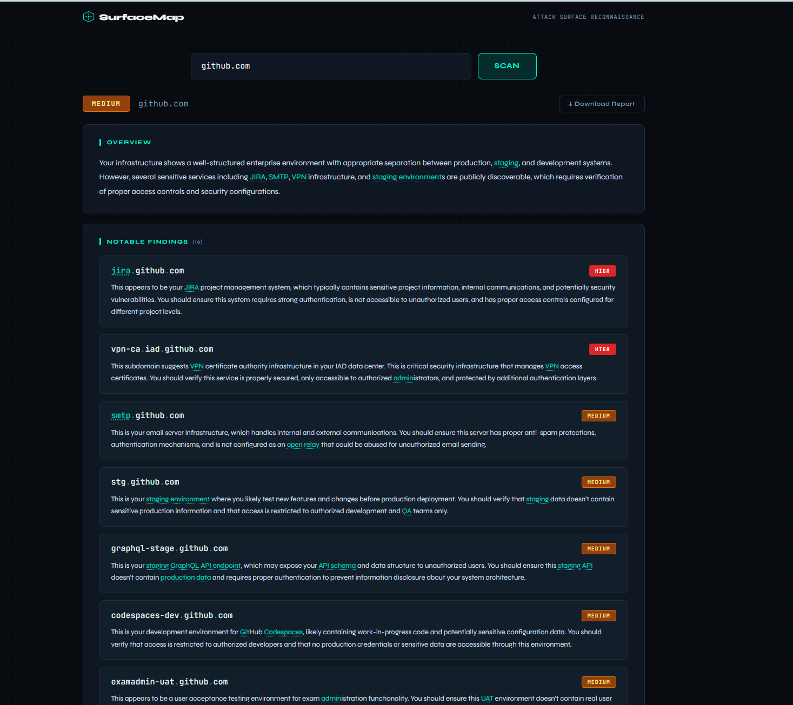

# SurfaceMap

AI-powered attack surface reconnaissance — enter a domain, get a structured security awareness report.

---



---

## Features

- **Subdomain enumeration** via crt.sh Certificate Transparency logs
- **AI-generated security report** powered by Claude (Anthropic) — overview, findings, recommendations
- **Color-coded risk levels** — High / Medium / Low based on business impact
- **Dynamic glossary tooltips** — hover any technical term for a plain-English definition
- **PDF export** — download a clean, formatted report of every scan
- **Multi-step loading indicator** — real-time feedback during the scan pipeline
- **Dark terminal-inspired UI** — built for security professionals

---

## Tech Stack

| Layer | Technology |
|---|---|
| Backend | Python 3.11, FastAPI, uvicorn |
| HTTP client | httpx (async) |
| AI | Anthropic Claude API (`claude-sonnet-4-20250514`) |
| Recon source | [crt.sh](https://crt.sh) Certificate Transparency API |
| Frontend | React 18, Vite 4 |
| PDF export | jsPDF |
| Fonts | Syne, JetBrains Mono (Google Fonts) |
| Deployment | Railway (backend), Vercel (frontend) |

---

## Running Locally

### Prerequisites

- Python 3.11+
- Node.js 18+
- An [Anthropic API key](https://console.anthropic.com)

### 1. Clone the repo

```bash
git clone https://github.com/ryandafoe/SurfaceMap.git
cd SurfaceMap
```

### 2. Backend

```bash
cd backend
pip install -r requirements.txt
```

Create a `.env` file in the `backend/` folder:

```bash
cp .env.example .env
# Open .env and add your ANTHROPIC_API_KEY
```

Start the server:

```bash
uvicorn main:app --reload
# API runs at http://localhost:8000
```

### 3. Frontend

```bash
cd frontend
npm install
npm run dev
# App runs at http://localhost:5173
```

Open `http://localhost:5173`, enter a domain, and run your first scan.

---

## Environment Variables

| Variable | Required | Description |
|---|---|---|
| `ANTHROPIC_API_KEY` | Yes | Your Anthropic API key — get one at [console.anthropic.com](https://console.anthropic.com) |

The frontend reads `VITE_API_URL` at build time. In development this defaults to `http://localhost:8000`. In production the value is set in `frontend/.env.production`.

---

## How It Works

```
User enters domain
       │
       ▼
FastAPI /scan endpoint
       │
       ├──▶ crt.sh API
       │    Certificate Transparency logs
       │    → returns list of known subdomains
       │
       └──▶ Anthropic Claude API
            Subdomains sent as context
            → returns structured JSON:
              • risk_level (High / Medium / Low)
              • overview (executive summary)
              • findings (top 10 notable subdomains)
              • recommendations (actionable steps)
              • glossary (15-20 scan-specific terms)
                         │
                         ▼
              React frontend renders report
              Glossary terms highlighted with
              hover tooltips throughout the UI
```

The backend never stores scan results — every request is stateless.

---

## Project Status

This is a portfolio project built to demonstrate full-stack development with AI integration. It is not intended as a production security tool. Always ensure you have permission before scanning any domain you do not own.

---

## License

MIT
